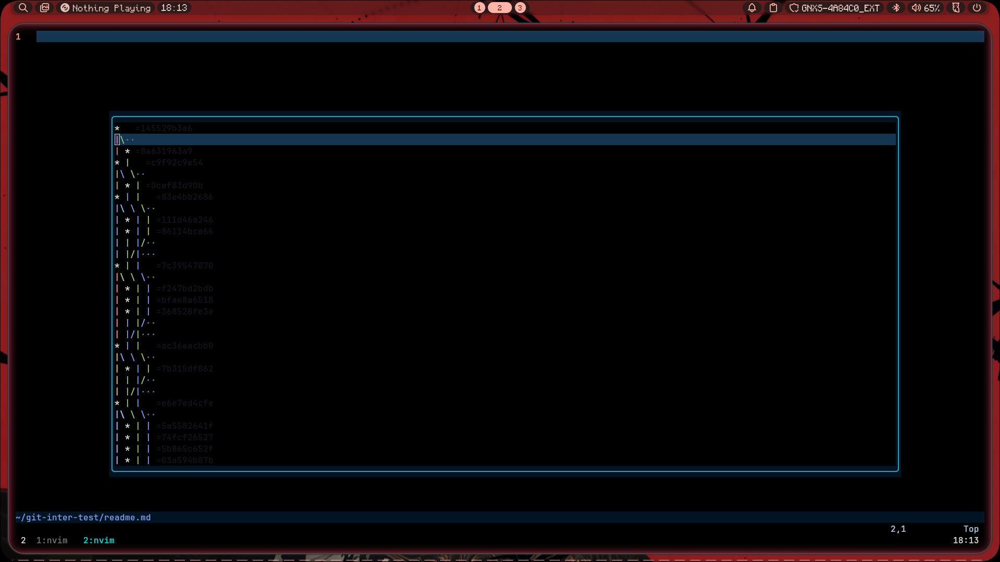

# Git intergration for nvim



## installation

For Lazy:

```lua
{
    'hakabol/git_intergration',
    dependencies = {
        "m00qek/baleia.nvim",
        'lewis6991/gitsigns.nvim',
        'barrettruth/diffs.nvim',
    },
    config = function () require("git-nvim").setup() end,
}
```

## usage

> Note: these instructions are with the default config of the plugin

### keybinds

- `<leader>gu` brings up the gui
- `q` closes the gui
- `<leader>gb` makes a new branch
- `e` gives info about the commit
- `s` switches to selected branch
- `<leader>gp` pushes the repo
- `<leader>gc` makes a commit (and adds)
- `m` merges the selected branch to chosen branches(typed)
- `d` shows the difference between the selected file in its current state and selected commmit

### usage

only `<leader>gu`, `<leader>gc`, `<leader>gb` and `<leader>gp` will work without gui

when using `m`, `e`, `s`, `d` and `q` you must select the commit to perform it on

## customisation

this doesnt have much custumisation options except:

- width
- height
- glog(the graph)
- maximum_depth (how much commits does the thing process)
- diff (the difference command)

default options:

```lua
{
    'hakabol/git_intergration',
    config = function () require("git-nvim").setup({
        width = 150,
        height = 30,
        maximum_depth = 1000, --lower if too laggy
        diff = "Diff" -- the command will become Diff <Hash>
        glog = {
            "git",
            "log",
            "--graph",
            "--all",
            "--decorate",
            "--pretty=format:=%H",
        }
    }) end,
}
```
